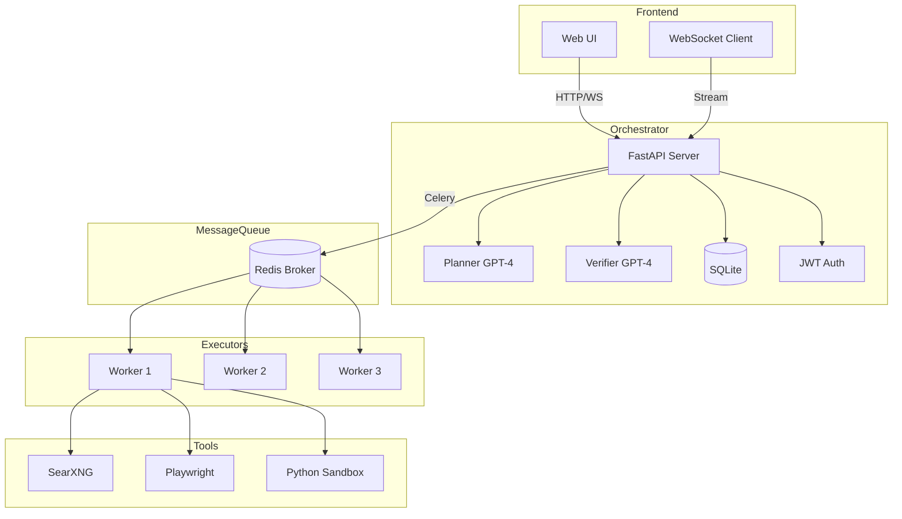
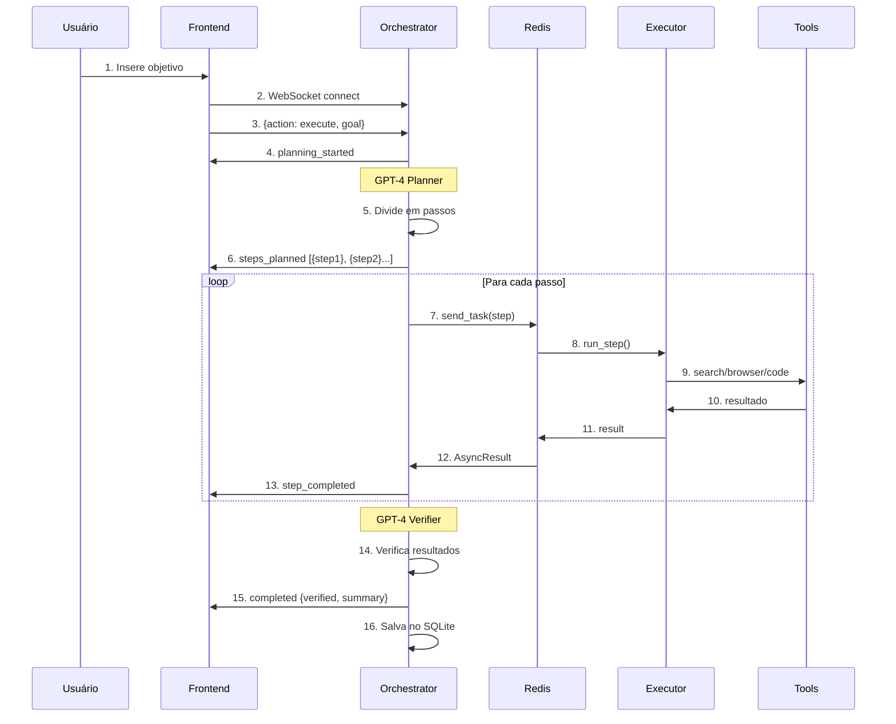

# 🤖 orbit-ai-orchestrator

> Sistema de automação de tarefas complexas usando IA com arquitetura Plan-Execute-Verify

[](https://github.com/lucianoon/orbit-ai-orchestrator/actions/workflows/ci.yml)
[](https://fastapi.tiangolo.com)
[](https://python.org)
[](LICENSE)

> **📦 Arquivado — sucedido pelo [Forgehand](https://github.com/lucianoon/forgehand).**
>
> Este repositório é a versão inicial da ideia: um orquestrador Plan-Execute-Verify
> com API FastAPI, workers Celery e ferramentas de busca, browser e execução de
> código. O que ficou pronto aqui e vale como referência são os **testes de
> integração contra Redis e worker Celery reais no CI** — não mocks.
>
> A evolução completa da arquitetura — orquestração LangGraph, fan-out paralelo,
> judge LLM com veto objetivo, gates humanos, memória persistente e execução
> durável em PostgreSQL — está no [**Forgehand**](https://github.com/lucianoon/forgehand),
> com [relatório de piloto](https://github.com/lucianoon/forgehand/blob/main/docs/pilot-report-2026-07-20.md)
> e métricas medidas. O desenvolvimento ativo acontece lá.
>
> O código aqui continua funcional e legível, mas o roadmap abaixo não será executado.

---

## 📖 Índice

- [Visão Geral](#-visão-geral)
- [Arquitetura do Sistema](#-arquitetura-do-sistema)
- [Fluxo de Dados](#-fluxo-de-dados)
- [Componentes](#-componentes)
- [Stack Tecnológica](#-stack-tecnológica)
- [API Reference](#-api-reference)
- [Instalação](#-instalação)
- [Deploy com Docker](#-deploy-com-docker)
- [Roadmap](#-roadmap)

---

## 🎯 Visão Geral

**Nome do repositório:** `orbit-ai-orchestrator`
**Nome do produto:** `Orbit AI Orchestrator`

O **Orbit AI Orchestrator** é um sistema que automatiza tarefas complexas dividindo-as em passos menores, executando cada passo com ferramentas especializadas (busca web, browser, código), e verificando os resultados com IA.

### Status e escopo

> **Projeto em estágio inicial de desenvolvimento.** A suíte cobre as unidades
> determinísticas (autenticação, histórico, planejamento/verificação,
> sandbox de código e roteamento de tools) com **30 testes unitários**, mais
> **4 testes de integração** que sobem um worker Celery real contra Redis real
> no CI — incluindo o fluxo `POST /task` ponta a ponta com sandbox executando
> código de verdade. Os serviços externos (OpenAI, SearXNG, Chromium) seguem
> sem deploy público; avalie o projeto pelo código e pelo pipeline de testes.

### Características Principais

| Feature | Descrição |
|---------|-----------|
| 🧠 **Plan-Execute-Verify** | Arquitetura de 3 fases com GPT-4 |
| ⚡ **WebSocket Streaming** | Visualize passos em tempo real |
| 💾 **Histórico Persistente** | SQLite configurável para salvar tarefas |
| 🔒 **Autenticação por Token** | Login com tokens persistidos em banco |
| 🐳 **Docker Ready** | Deploy com um comando |
| 🌐 **UI Moderna** | Dark mode, glassmorphism |

---

## 🏗️ Arquitetura do Sistema

```
┌─────────────────────────────────────────────────────────────────────────────┐
│                               ORBIT ORCHESTRATOR                             │
└─────────────────────────────────────────────────────────────────────────────┘

                                    ┌──────────────┐
                                    │   USUÁRIO    │
                                    │  (Browser)   │
                                    └──────┬───────┘
                                           │
                           HTTP/WebSocket  │  :3000
                                           ▼
┌──────────────────────────────────────────────────────────────────────────────┐
│                              FRONTEND (Nginx)                                │
│  ┌─────────────┐  ┌─────────────┐  ┌─────────────┐  ┌─────────────────────┐ │
│  │ index.html  │  │ styles.css  │  │   app.js    │  │   WebSocket Client  │ │
│  └─────────────┘  └─────────────┘  └─────────────┘  └─────────────────────┘ │
└──────────────────────────────────────┬───────────────────────────────────────┘
                                       │
                          REST API / WebSocket  :8000
                                       ▼
┌──────────────────────────────────────────────────────────────────────────────┐
│                          ORCHESTRATOR (FastAPI)                              │
│                                                                              │
│  ┌──────────────┐  ┌──────────────┐  ┌──────────────┐  ┌──────────────────┐ │
│  │   main.py    │  │   graph.py   │  │ database.py  │  │     auth.py      │ │
│  │  (Endpoints) │  │  (AI Logic)  │  │  (SQLite)    │  │  (JWT Tokens)    │ │
│  └──────────────┘  └──────────────┘  └──────────────┘  └──────────────────┘ │
└──────────────────────────────────────┬───────────────────────────────────────┘
                                       │
                              Celery Tasks (async)
                                       ▼
┌──────────────────────────────────────────────────────────────────────────────┐
│                               REDIS (Broker)                                 │
│                            Message Queue + Cache                :6379        │
└──────────────────────────────────────┬───────────────────────────────────────┘
                                       │
                              Celery Workers (x3)
                                       ▼
┌──────────────────────────────────────────────────────────────────────────────┐
│                           EXECUTOR (Celery Worker)                           │
│                                                                              │
│  ┌─────────────────────────┐ ┌─────────────────────────┐ ┌────────────────┐ │
│  │  tools/search.py        │ │  tools/browser.py       │ │ tools/run_code │ │
│  │  (SearXNG API)          │ │  (Playwright)           │ │ (Sandboxed)    │ │
│  └───────────┬─────────────┘ └───────────┬─────────────┘ └────────────────┘ │
└──────────────┼───────────────────────────┼───────────────────────────────────┘
               │                           │
               ▼                           ▼
┌──────────────────────────────┐ ┌─────────────────────────────────────────────┐
│       SearXNG :8080          │ │           Playwright Container              │
│   (Privacy Search Engine)    │ │         (Headless Chrome Browser)           │
└──────────────────────────────┘ └─────────────────────────────────────────────┘
```

### Diagrama Mermaid



---

## 📊 Fluxo de Dados



---

## 🧩 Componentes

### Orchestrator (`/orchestrator`)

| Arquivo | Responsabilidade |
|---------|------------------|
| `main.py` | Endpoints REST, WebSocket, CORS, integração |
| `graph.py` | Lógica de IA - Planner e Verifier com LangChain |
| `database.py` | Persistência de histórico via SQLite configurável |
| `auth.py` | Autenticação por token e hash de senhas (PBKDF2) |
| `schemas.py` | Modelos Pydantic para validação |
| `settings.py` | Configurações via environment variables |
| `logger.py` | Logging estruturado com structlog |

### Executor (`/executor`)

| Arquivo | Responsabilidade |
|---------|------------------|
| `worker.py` | Celery worker - processa tarefas da fila |
| `tools/search.py` | Busca web via SearXNG API |
| `tools/browser.py` | Scraping de páginas com Playwright |
| `tools/run_code.py` | Execução de Python em sandbox |
| `settings.py` | Configurações do executor |

### Frontend (`/frontend`)

| Arquivo | Responsabilidade |
|---------|------------------|
| `index.html` | Estrutura da UI |
| `styles.css` | Estilos com glassmorphism e dark mode |
| `app.js` | Lógica: WebSocket, REST fallback, histórico |

---

## 🔧 Stack Tecnológica

```
┌─────────────────────────────────────────────────────────┐
│                    STACK TECNOLÓGICA                    │
├───────────────┬─────────────────────────────────────────┤
│  Frontend     │  HTML5 + CSS3 + Vanilla JavaScript      │
│  API          │  FastAPI + Uvicorn + WebSocket          │
│  AI/LLM       │  LangChain + OpenAI GPT-4               │
│  Queue        │  Celery + Redis                         │
│  Database     │  SQLite (dev) / PostgreSQL (prod)       │
│  Search       │  SearXNG (self-hosted, privacy-first)   │
│  Browser      │  Playwright (Chromium headless)         │
│  Auth         │  PBKDF2 + Token-based (JWT-like)        │
│  Deploy       │  Docker Compose                         │
└───────────────┴─────────────────────────────────────────┘
```

---

## 📡 API Reference

### Tarefas

| Método | Endpoint | Descrição |
|--------|----------|-----------|
| `POST` | `/task` | Executar nova tarefa |
| `WS` | `/ws/{task_id}` | WebSocket streaming |

### Histórico

| Método | Endpoint | Descrição |
|--------|----------|-----------|
| `GET` | `/history` | Listar tarefas |
| `GET` | `/history/{id}` | Detalhes de uma tarefa |
| `DELETE` | `/history/{id}` | Deletar tarefa |

### Autenticação

| Método | Endpoint | Descrição |
|--------|----------|-----------|
| `POST` | `/auth/register` | Criar conta |
| `POST` | `/auth/login` | Login (retorna token) |
| `GET` | `/auth/me` | Info do usuário atual |
| `POST` | `/auth/logout` | Invalidar token |

### Exemplo de Requisição

```bash
# Executar tarefa
curl -X POST http://localhost:8000/task \
  -H "Content-Type: application/json" \
  -d '{"goal": "O que é machine learning?", "wide": false}'

# Resposta
{
  "goal": "O que é machine learning?",
  "steps": [
    {
      "step": "Pesquisar definição de machine learning",
      "output": "Machine learning é uma área da IA...",
      "evidence": [{"url": "...", "title": "..."}]
    }
  ],
  "verified": true,
  "summary": "OK: Definição completa de ML com exemplos práticos."
}
```

---

## 🚀 Instalação

### Higiene de repositório

- O repositório deve ser publicado sem `venv/`, arquivos `.env` e bancos locais `.db`.
- Antes de subir para o GitHub, copie `.env.example` para `.env` e preencha os valores reais.
- Os bancos locais agora podem ser configurados por `APP_DATA_DIR`, `HISTORY_DB_PATH` e `AUTH_DB_PATH`.

### Pré-requisitos

- Python 3.11+
- Docker & Docker Compose
- Chave API OpenAI

### Setup Local

```bash
# 1. Clone o repositório
git clone https://github.com/lucianoon/orbit-ai-orchestrator.git
cd orbit-ai-orchestrator

# 2. Crie ambiente virtual
python -m venv venv
.\venv\Scripts\Activate.ps1  # Windows
source venv/bin/activate     # Linux/Mac

# 3. Instale dependências
pip install -r orchestrator/requirements.txt
pip install -r executor/requirements.txt

# 4. Configure variáveis de ambiente
cp .env.example .env
# Edite .env e adicione sua OPENAI_API_KEY

# 5. Inicie os serviços
# Terminal 1 - Redis
docker run -d --name redis -p 6379:6379 redis:7-alpine

# Terminal 2 - SearXNG
docker run -d --name searxng -p 8080:8080 searxng/searxng:latest

# Terminal 3 - Orchestrator
cd orchestrator
$env:OPENAI_API_KEY = "sua-chave"
uvicorn main:app --reload

# Terminal 4 - Executor
cd executor
celery -A worker worker --loglevel=info --pool=solo

# Terminal 5 - Frontend
cd frontend
python -m http.server 3000
```

### Acessar

- **UI**: http://localhost:3000
- **API Docs**: http://localhost:8000/docs
- **SearXNG**: http://localhost:8080

---

## 🧪 Testes

Duas camadas, ambas no CI:

**Unitários (30)** — sem rede, sem Redis e sem chave da OpenAI (LLM e broker são
simulados nos testes de API):

| Suíte | O que verifica |
|-------|----------------|
| `test_auth.py` | Hash PBKDF2, tokens com expiração, usuários duplicados |
| `test_database.py` | Ciclo de vida de tasks/steps, roundtrip de evidências em JSON |
| `test_graph.py` | Parsing de planos e do veredito OK/FALHA do verificador |
| `test_run_code.py` | Runner com rlimits e execução real de código em subprocesso |
| `test_worker.py` | Roteamento de passos para a tool correta |
| `test_api.py` | `/task` ponta a ponta (200/400/502), histórico e fluxo de auth |

**Integração (4)** — Redis real como service container do CI e worker Celery em
subprocesso, exatamente como em produção (`celery -A worker worker --pool=solo`):

| Teste | O que verifica |
|-------|----------------|
| broker roundtrip | `send_task` por nome atravessa o Redis; sandbox devolve output real |
| degradação de busca | SearXNG fora do ar → output de erro, task não quebra |
| consistência de config | orchestrator e executor dividem broker e fila |
| API e2e | `POST /task` com despacho, polling e execução 100% reais |

```bash
# Unitários (não exigem nada além do venv)
pip install -r requirements-dev.txt
pytest -q --ignore=tests/integration

# Integração (requer Redis local)
REDIS_URL=redis://localhost:6379/15 pytest tests/integration
```

---

## 🐳 Deploy com Docker

```bash
# 1. Configure variáveis
cp .env.example .env
# Edite .env com suas chaves

# 2. Inicie todos os serviços
docker-compose up -d

# 3. Verifique status
docker-compose ps

# 4. Logs
docker-compose logs -f orchestrator
```

### Serviços Docker

| Serviço | Porta | Descrição |
|---------|-------|-----------|
| `redis` | 6379 | Message broker |
| `searxng` | 8080 | Search engine |
| `orchestrator` | 8000 | API principal |
| `executor` | - | Workers (x3) |
| `frontend` | 3000 | Web UI |
| `playwright` | - | Browser automation |

---

## 🗺️ Roadmap

### ✅ Implementado

- [x] Arquitetura Plan-Execute-Verify
- [x] WebSocket streaming em tempo real
- [x] Banco de dados SQLite
- [x] Autenticação JWT
- [x] UI com dark mode
- [x] Docker Compose

### 🔜 Próximas Features

- [ ] **Billing/Stripe** - Cobrança por uso
- [ ] **Rate Limiting** - Controle de requisições
- [ ] **Multi-tenancy** - Isolamento por empresa
- [ ] **Múltiplos LLMs** - GPT-4, Claude, Gemini
- [ ] **Templates** - Tarefas pré-configuradas
- [ ] **Webhooks** - Notificações externas
- [ ] **Dashboard Admin** - Métricas e gerenciamento

---

## 📄 Licença

MIT License - veja [LICENSE](LICENSE) para detalhes.

---

## 👥 Contribuição

Contribuições são bem-vindas! Abra uma issue ou pull request.

---

<p align="center">
  <strong>orbit-ai-orchestrator</strong> - Automação inteligente de tarefas
  <br>
  Powered by <a href="https://langchain.com">LangChain</a> + <a href="https://openai.com">OpenAI GPT-4</a>
</p>
